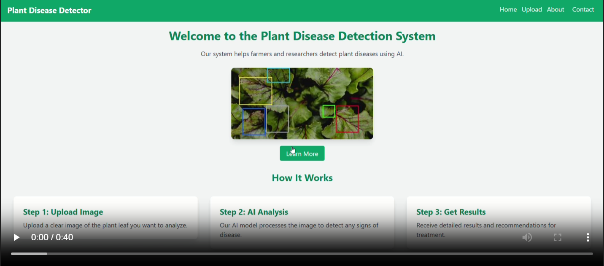

# Plant Leaf Disease Detection

## Introduction
Plant Leaf Disease Detection is a project aimed at identifying and classifying diseases in plant leaves using machine learning techniques. This tool helps farmers and gardeners to detect diseases early and take necessary actions to protect their crops.

## Features
- Detects plant leaf diseases
- Provides detailed information about the detected disease
- User-friendly interface for uploading and analyzing leaf images
- High accuracy and fast processing

## Contribution
Contributions are welcome! Please fork the repository and create a pull request with your changes. Ensure your code follows the project's coding standards and includes appropriate tests.

## License
This project is licensed under the MIT License. See the [LICENSE](LICENSE) file for more details.

## Preview

## Contact
For any inquiries or feedback or if you need the project, please contact Pavan Kumar Garapati at pavankumargarapati04@gmail.com.